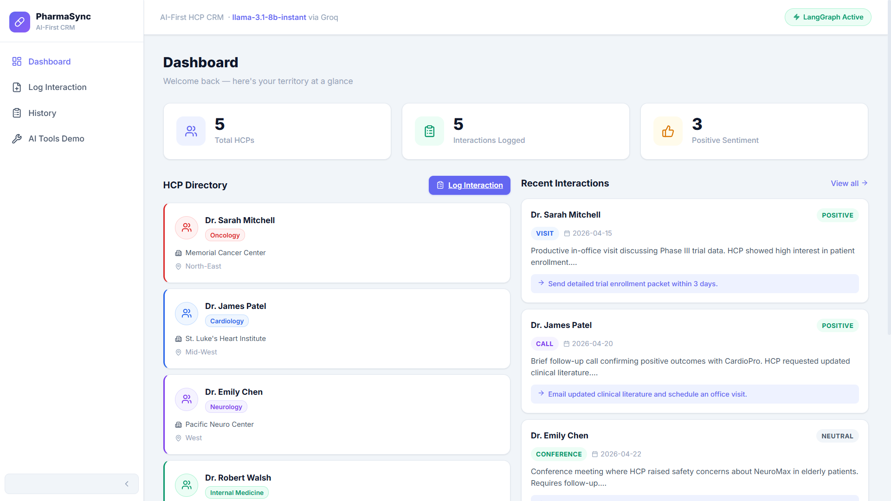
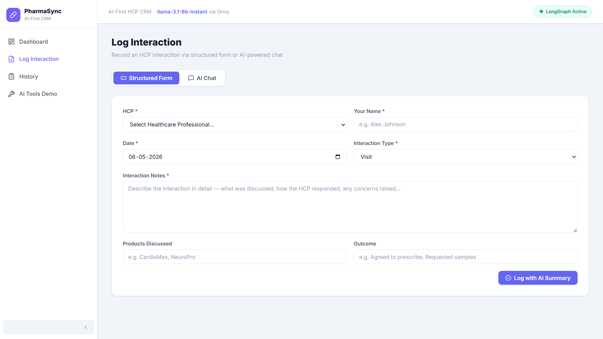
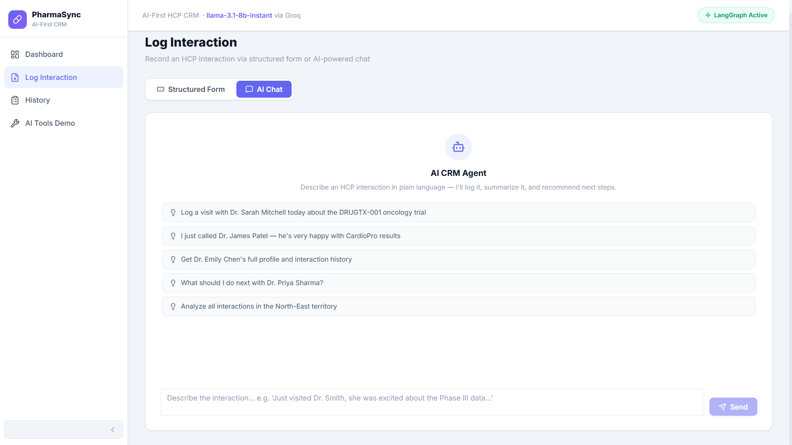
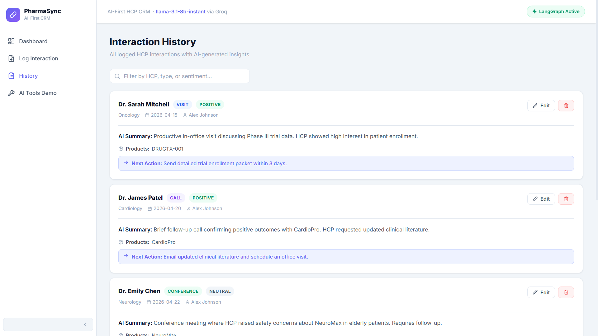
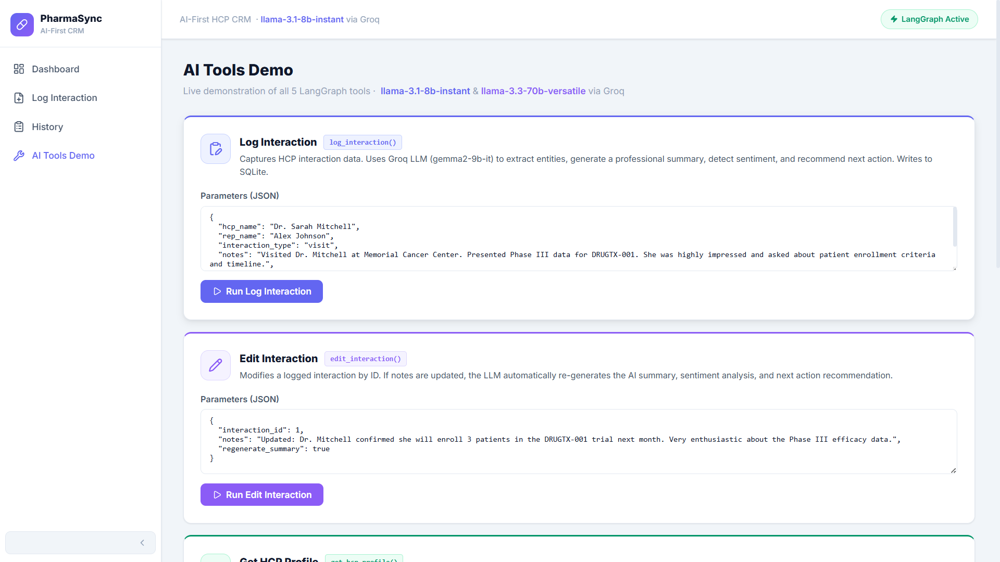

# 💊 PharmaSync — AI-First CRM HCP Module

> An AI-powered CRM for pharmaceutical field representatives to log and manage interactions with Healthcare Professionals (HCPs). Features a **dual-mode Log Interaction screen** (Structured Form + AI Chat) powered by a **LangGraph agent** using Groq's `llama-3.1-8b-instant` model.

---

## User Interface

### Dashboard


### Log Interaction — Structured Form


### Log Interaction — AI Chat


### Interaction History


### AI Tools Demo


---

## 🏗️ Architecture

```
┌─────────────────────────┐        ┌──────────────────────────────┐
│   React 18 + Vite       │  HTTP  │   FastAPI (Python)            │
│   Redux Toolkit         │◄──────►│   SQLite + SQLAlchemy         │
│   React Router v6       │        │   LangGraph 0.4 (ReAct)       │
│   Lucide React Icons    │        │   Groq API                    │
│   Vanilla CSS           │        │     ├─ llama-3.1-8b (primary) │
│                         │        │     └─ llama-3.3-70b (context)│
│  Pages:                 │        │                               │
│  • Dashboard            │        │  5 LangGraph Tools:           │
│  • Log Interaction      │        │   1. log_interaction          │
│    ├─ Structured Form   │        │   2. edit_interaction         │
│    └─ AI Chat           │        │   3. get_hcp_profile          │
│  • History + Edit Modal │        │   4. suggest_next_action      │
│  • Tool Demo Panel      │        │   5. analyze_interaction_hist │
│  • HCP Detail           │        │                               │
└─────────────────────────┘        └──────────────────────────────┘
     Vercel                              Render
```

---

## 🤖 LangGraph Agent & 5 Tools

| # | Tool | Model | Description |
|---|------|-------|-------------|
| 1 | `log_interaction` | llama-3.1-8b-instant | Captures interaction data, generates AI summary, detects sentiment, recommends next action. Persists to SQLite. |
| 2 | `edit_interaction` | llama-3.1-8b-instant | Edits interaction by ID. LLM re-generates summary if notes are changed. |
| 3 | `get_hcp_profile` | llama-3.1-8b-instant | Full HCP profile with history, engagement score, last visit, and AI engagement narrative. |
| 4 | `suggest_next_action` | llama-3.3-70b-versatile | Analyzes interaction history and returns 3 tactical next-step sales recommendations. |
| 5 | `analyze_interaction_history` | llama-3.3-70b-versatile | Territory-wide trend analysis: sentiment breakdown, visit frequency, engagement gaps, performance report. |

---

## 📁 Project Structure

```
pharmasync-crm/
├── .gitignore
├── README.md
├── backend/
│   ├── main.py              # FastAPI entry point, CORS, seed data
│   ├── database.py          # SQLAlchemy + SQLite
│   ├── models.py            # HCP, Interaction ORM models
│   ├── schemas.py           # Pydantic schemas
│   ├── requirements.txt
│   ├── render.yaml          # Render deployment config
│   ├── .env                 # Local env (not committed)
│   ├── .env.example
│   ├── agent/
│   │   ├── graph.py         # LangGraph ReAct StateGraph
│   │   ├── tools.py         # 5 tool definitions
│   │   └── llm.py           # Groq client
│   └── routers/
│       ├── hcps.py
│       ├── interactions.py
│       └── chat.py
│
└── frontend/
    ├── vercel.json          # Vercel SPA routing config
    ├── .env                 # Local env (not committed)
    ├── .env.example
    └── src/
        ├── api/index.js     # Axios + VITE_API_URL
        ├── store/           # Redux slices
        └── pages/           # Dashboard, Log, History, Tools, HCP
```

---

## 🚀 Local Development

### Prerequisites
- Python 3.10+
- Node.js 18+

### Backend
```bash
cd backend
pip install -r requirements.txt
# Copy and fill in your env
cp .env.example .env
uvicorn main:app --reload --host 0.0.0.0 --port 8000
```

### Frontend
```bash
cd frontend
npm install
# Copy and fill in your env
cp .env.example .env
npm run dev
```

Open **http://localhost:5173**

---

## ☁️ Deployment

### Backend → Render

1. Go to [render.com](https://render.com) → **New Web Service**
2. Connect your GitHub repo → select the **root** directory
3. Set these fields:

| Field | Value |
|-------|-------|
| **Name** | `pharmasync-crm-backend` |
| **Root Directory** | `backend` |
| **Environment** | `Python 3` |
| **Build Command** | `pip install -r requirements.txt` |
| **Start Command** | `uvicorn main:app --host 0.0.0.0 --port $PORT` |

4. Add **Environment Variables** in Render dashboard:

| Key | Value |
|-----|-------|
| `GROQ_API_KEY` | `gsk_...your key...` |
| `DATABASE_URL` | `sqlite:///./crm.db` |
| `FRONTEND_URL` | *(add after Vercel deploy, e.g. `https://pharmasync.vercel.app`)* |

5. Click **Deploy** — copy the URL: `https://pharmasync-crm-backend.onrender.com`

> ⚠️ Render's free tier uses ephemeral storage — the SQLite DB resets on redeploy. For persistence, upgrade to a PostgreSQL add-on and update `DATABASE_URL`.

---

### Frontend → Vercel

1. Go to [vercel.com](https://vercel.com) → **New Project**
2. Import your GitHub repo
3. Set these fields:

| Field | Value |
|-------|-------|
| **Framework Preset** | `Vite` |
| **Root Directory** | `frontend` |
| **Build Command** | `npm run build` |
| **Output Directory** | `dist` |

4. Add **Environment Variables** in Vercel dashboard:

| Key | Value |
|-----|-------|
| `VITE_API_URL` | `https://pharmasync-crm-backend.onrender.com` |

5. Click **Deploy** — your app is live!

6. Go back to **Render** and set `FRONTEND_URL` to your Vercel URL.

---

## 🌐 API Endpoints

| Method | Endpoint | Description |
|--------|----------|-------------|
| GET | `/health` | Health check |
| GET | `/tools` | List all 5 LangGraph tools |
| GET | `/hcps/` | List all HCPs |
| GET | `/hcps/{id}` | HCP + full interaction history |
| POST | `/hcps/` | Create HCP |
| GET | `/interactions/` | List all interactions |
| POST | `/interactions/` | Create (AI-enriched) |
| PUT | `/interactions/{id}` | Edit + AI re-summarize |
| DELETE | `/interactions/{id}` | Delete |
| POST | `/chat/` | LangGraph agent chat |
| POST | `/chat/tool` | Direct tool invocation |

Swagger UI: `https://your-backend.onrender.com/docs`

---

## 🔑 Environment Variables

### Backend (`.env`)
```env
GROQ_API_KEY=gsk_...
DATABASE_URL=sqlite:///./crm.db
FRONTEND_URL=https://your-app.vercel.app   # optional, for CORS
```

### Frontend (`.env`)
```env
VITE_API_URL=http://localhost:8000          # local dev
# VITE_API_URL=https://your-backend.onrender.com   # production
```

---

## 🎨 Tech Stack

| Layer | Technology |
|-------|-----------|
| Frontend | React 18 + Vite |
| State | Redux Toolkit |
| Routing | React Router v6 |
| Icons | Lucide React |
| HTTP | Axios |
| Styling | Vanilla CSS (Light theme, Inter font) |
| Backend | FastAPI (Python) |
| Database | SQLite + SQLAlchemy |
| AI Agent | LangGraph 0.4 (ReAct) |
| LLM | Groq — llama-3.1-8b-instant + llama-3.3-70b-versatile |
| Deploy | Vercel (frontend) + Render (backend) |

---

## 📜 License

MIT License - See LICENSE file for details
